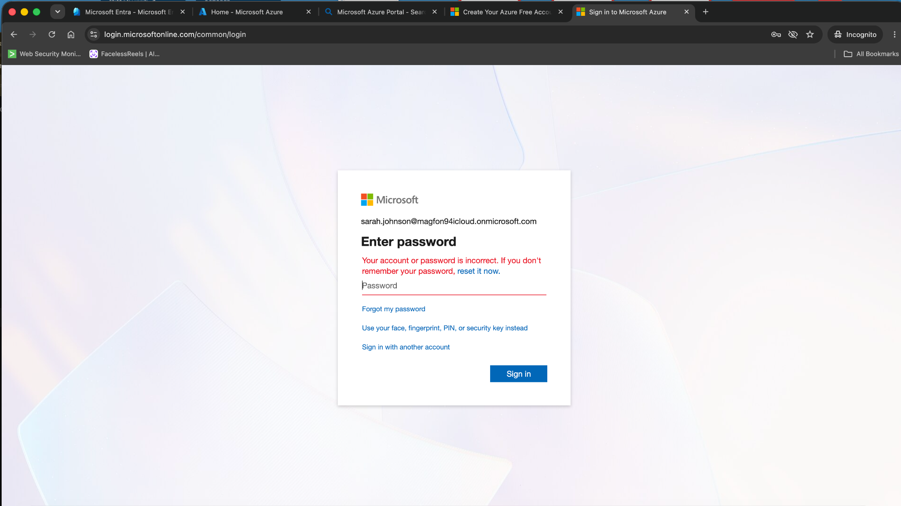
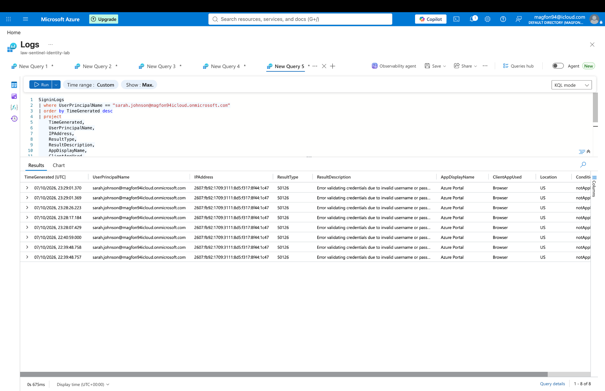
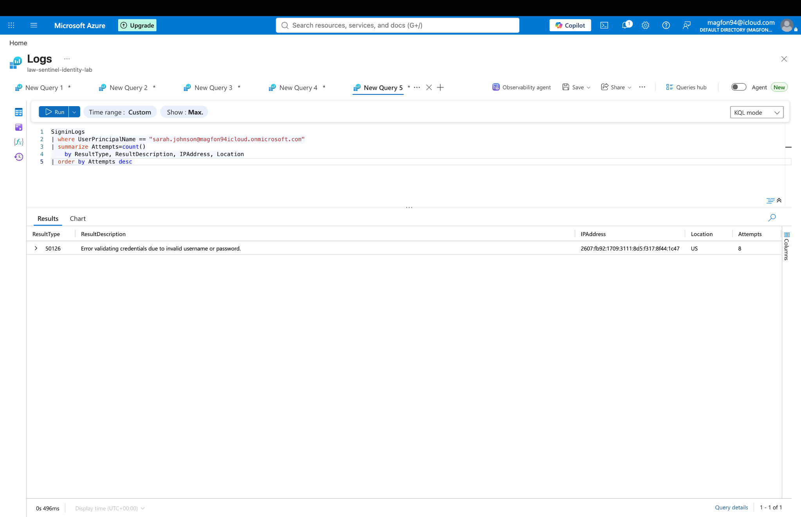
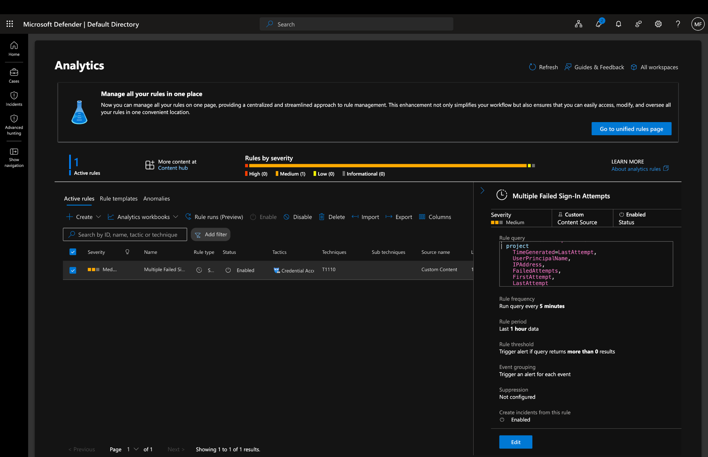
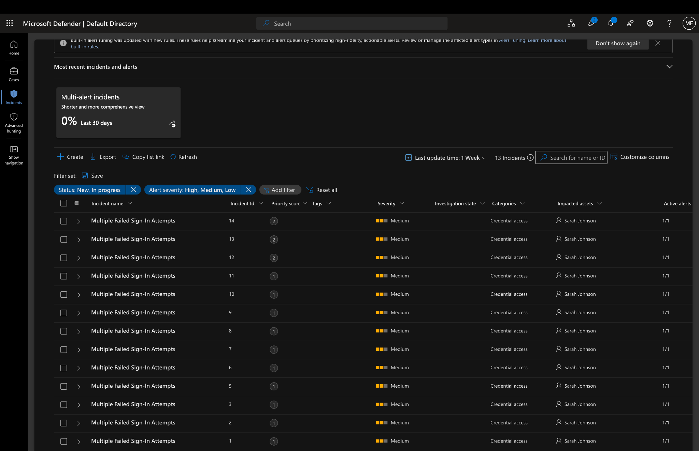
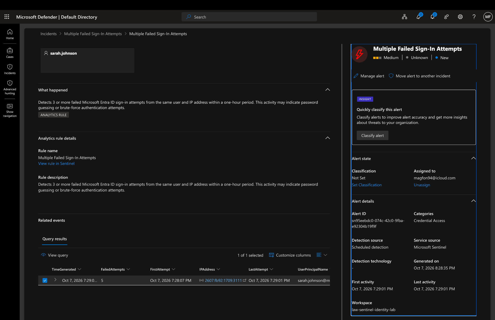
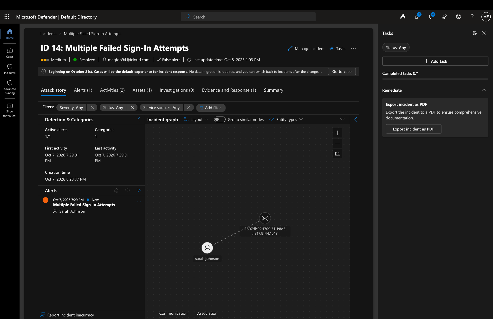
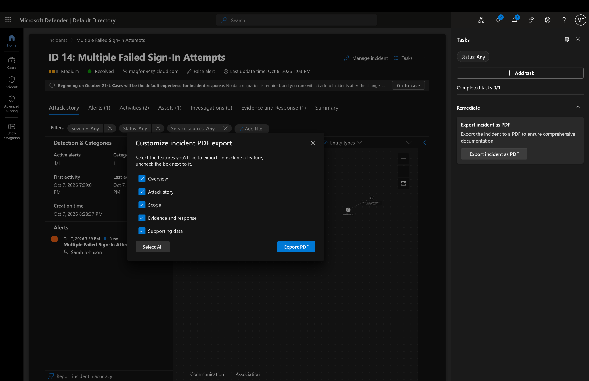

# Microsoft Sentinel SOC Detection Lab

## Overview

This project demonstrates an end-to-end Security Operations Center (SOC) detection and incident response workflow using Microsoft Sentinel, Microsoft Entra ID, Log Analytics, Kusto Query Language (KQL), Microsoft Defender, and MITRE ATT&CK.

The lab simulates repeated failed authentication attempts, analyzes Microsoft Entra ID sign-in telemetry, detects suspicious activity using KQL, generates a Microsoft Sentinel incident, investigates the affected entities, and documents the final incident resolution.

---

## Project Objectives

The objectives of this lab were to:

- Analyze Microsoft Entra ID authentication logs
- Develop KQL queries for threat detection
- Detect repeated failed sign-in attempts
- Configure a Microsoft Sentinel analytics rule
- Generate alerts and security incidents
- Investigate users and source IP addresses
- Analyze incidents using Microsoft Sentinel and Microsoft Defender
- Map the detection to MITRE ATT&CK
- Tune detection logic to reduce alert noise
- Document and classify the incident after investigation

---

## Lab Architecture

The detection workflow used in this project follows:

**Authentication Activity → Microsoft Entra ID → Log Analytics → KQL Detection → Microsoft Sentinel Analytics Rule → Alert → Incident → Investigation → Resolution**

The primary data source used for detection was the Microsoft Entra ID `SigninLogs` table.

---

## Detection Scenario

The lab focuses on detecting multiple failed authentication attempts against the same user account.

Repeated authentication failures from the same source IP address can indicate:

- Password guessing
- Brute-force attacks
- Credential attacks
- Misconfigured applications
- Legitimate users repeatedly entering incorrect credentials

The detection threshold used in this lab was **three or more failed sign-in attempts**.

---

## KQL Detection Query

The following KQL query was used to identify repeated failed authentication attempts:

```kusto
SigninLogs
| where ResultType != 0
| summarize
    FailedAttempts=count(),
    FirstAttempt=min(TimeGenerated),
    LastAttempt=max(TimeGenerated)
    by UserPrincipalName, IPAddress
| where FailedAttempts >= 3
| project
    TimeGenerated=LastAttempt,
    UserPrincipalName,
    IPAddress,
    FailedAttempts,
    FirstAttempt,
    LastAttempt
```

The query groups failed authentication events by user account and source IP address and identifies entities exceeding the configured threshold.

---

## Microsoft Sentinel Analytics Rule

The KQL detection was operationalized through a Microsoft Sentinel scheduled analytics rule.

### Rule Configuration

- **Rule:** Multiple Failed Sign-In Attempts
- **Severity:** Medium
- **Query frequency:** 5 minutes
- **Lookup period:** 1 hour
- **Trigger threshold:** 3 or more failed authentication attempts
- **Grouping:** User account and source IP address

This converts the KQL detection logic into an automated SOC detection capable of generating alerts and incidents for analyst investigation.

---

## MITRE ATT&CK Mapping

The detection was mapped to the MITRE ATT&CK framework:

- **Tactic:** Credential Access
- **Technique:** Brute Force
- **Technique ID:** T1110

This demonstrates how detection engineering can be aligned with recognized adversary tactics and techniques.

---

## Investigation Workflow

After Microsoft Sentinel generated the incident, the investigation included:

1. Reviewing the affected user account
2. Examining the source IP address
3. Reviewing individual failed authentication events
4. Examining Microsoft Entra ID result codes
5. Reviewing Conditional Access status
6. Correlating the alert with the generated incident
7. Reviewing the incident graph and associated entities
8. Using Microsoft Defender for additional incident investigation

---

## Alert Grouping and Detection Tuning

Repeated authentication failures associated with the same user and source IP were correlated to reduce duplicate alerts and provide analysts with a consolidated incident.

The detection threshold was configured to identify three or more failed authentication attempts.

This demonstrates an important SOC detection engineering principle: balancing **detection sensitivity** against **false positives and alert fatigue**.

---

## Incident Resolution

The simulated activity successfully generated a Microsoft Sentinel incident.

After investigation, the incident was resolved and classified as:

**False Positive – Not Malicious**

The incident report was exported to preserve investigation evidence and demonstrate the complete incident-response lifecycle.

---

# Lab Evidence

The `evidence/` directory contains screenshots documenting the detection and investigation workflow.

## 1. Failed Sign-In Simulation



Demonstrates the authentication activity used to generate failed sign-in telemetry.

## 2. Microsoft Entra ID Sign-In Logs



Shows Microsoft Entra ID authentication events used as the primary data source for the investigation.

## 3. KQL Failed Sign-In Detection



Demonstrates the KQL query used to identify repeated failed authentication attempts.

## 4. Microsoft Sentinel Analytics Rule



Shows the analytics rule used to operationalize the detection logic in Microsoft Sentinel.

## 5. Generated Microsoft Sentinel Incident



Demonstrates successful alert and incident generation from the analytics rule.

## 6. Alert Investigation



Shows investigation of the generated alert and associated security information.

## 7. Incident Graph and Resolution



Demonstrates entity correlation, incident investigation, and resolution.

## 8. Incident Report Export



Shows preservation of incident investigation evidence through report export.

---

## Repository Structure

```text
Microsoft-Sentinel-SOC-Detection-Lab/
│
├── README.md
├── queries/
│   └── failed-signin-detection.kql
├── docs/
│   └── analytics-rule.md
└── evidence/
    ├── README.md
    ├── 01-failed-signin-simulation.png
    ├── 02-entra-signin-log-events.png
    ├── 03-kql-failed-signin-detection.png
    ├── 04-sentinel-analytics-rule.png
    ├── 05-generated-incidents.png
    ├── 06-alert-investigation-details.png
    ├── 07-incident-graph-and-resolution.png
    └── 08-incident-pdf-export.png
```

---

## Skills Demonstrated

This project demonstrates practical experience with:

- Microsoft Sentinel
- Microsoft Entra ID
- Microsoft Defender
- Log Analytics
- Kusto Query Language (KQL)
- SIEM monitoring
- Detection engineering
- Security analytics rules
- Alert triage
- Incident investigation
- Entity correlation
- Authentication log analysis
- Detection tuning
- Incident response
- MITRE ATT&CK
- Security documentation

---

## Key Takeaway

This project demonstrates the complete lifecycle of a SOC detection: generating security telemetry, analyzing logs, developing detection logic, operationalizing the detection in a SIEM, generating an incident, investigating affected entities, tuning the detection, and documenting the final resolution.
